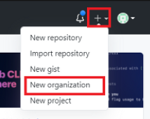
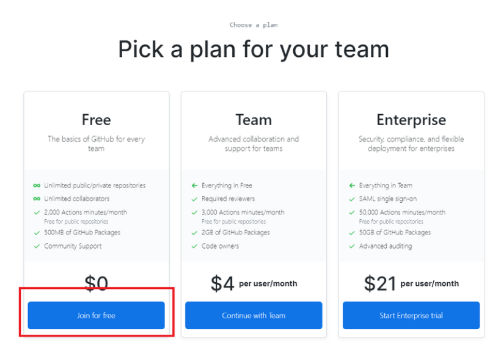
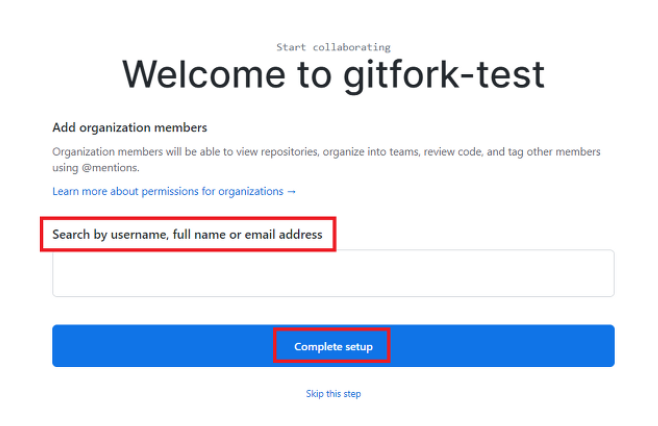
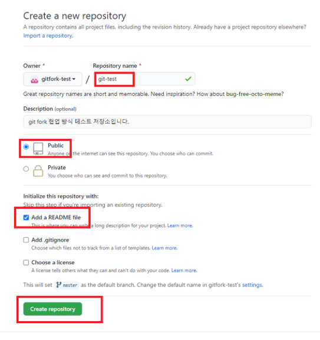
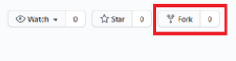

# 1. 조직 만들기

1. 조직 생성하기



2. 비용 설정(Free로 함)

   

3. 조직 설정

   

4. 팀원 초대하기

   


5. 설문조사 submit

   


# 2. 원격 저장소 만들기

1. Create a new repository 누르기


2. repository 설정

   


# 3. fork 하기

1. 위에서 생성한 repository에서 fork 누르기

   



2. 팀이 아닌 내 계정에 저장소가 생성됨

   

# 4. clone하기

로컬 저장소에 fork한거 복사하기

1. 원하는 장소에서 오른쪽 클릭 -> bash 실행

2. 로컬 저장소에 복사하기

   ```bash
   git clone [fork 저장소 URL]
   ```

   


# 5. 팀 원격저장소 추가

```bash
git remote add upstream [주소]

# 원격 저장소 확인 하고 싶으면
git remote -v
```

기본적으로 orgin에 fork한 주소가 이미 추가 되있음


# 6. branch 생성

```bash
git branch [branch이름]

# 있는 branch 확인하고 싶으면
git branch -v
```


# 7. 브랜치 이동하기

```bash
git checkout [branch이름]

# 현재 사용중이 branch 보고 싶으면 -> 초록색으로 표시됨
git branch -v
```


# 8. 내용 추가 or 수정

파일 내용 추가 및 수정


# 9. fork한 원격저장소에 보내기

```bash
git add [파일이름]

# 변경된거 확인하고 싶으면
git status

git commit -m "메시지"

# commit 내역 확인하고 싶으면
git log

git push origin [branch이름]
```


# 10. Compare&pull request

1. 팀원은 fork한 git에 들어가기
2. fork한 원격저장소에서 Compare&pull request 누르기

2. comment 남기기
3. Create pull request 누르기


# 11. Merge

1. merge 관리자는 팀 원격저장소 git에 들어가기
2. Pull requests에 들어가기
3.  Merge pull request를 누르기
4. Confirm 누르기


# 12. 통합한거 로컬 저장소에 가져오기

1. 로컬 저장소 main 브랜치 이동

   ```bash
   git checkout [branch이름]
   ```

2. 팀 원격저장소 main에서 로컬 저장소 main로 가져오기 

   ```bash
   git pull upstream main
   ```

   