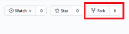

# 1. fork 하기

1. GitHub flow에서 fork 누르기

   



2. 내 계정에 원격 저장소가 생성됨

   

# 2. clone하기

로컬 저장소에 fork한거 복사하기

1. 원하는 장소에서 오른쪽 클릭 -> bash 실행

2. 로컬 저장소에 복사하기

   ```bash
   git clone {fork 저장소 URL}
   ```

   


# 3. 공용 원격저장소 추가

```bash
git remote add upstream {주소}

# 원격 저장소 확인(권장)
git remote -v
```

기본적으로 orgin에 fork한 주소가 이미 추가 되있음


# 4. branch 생성 및 이동

```bash
# branch 생성
git branch {feature/기능}
# branch 이동
git checkout {feature/기능}

or

#branch 생성 및 이동
git checkout -b {feature/기능}

# branch 목록 및 사용중인 branch 확인(권장)
git branch -v
```


# 5. 내용 추가 or 수정

파일 내용 추가 및 수정


# 6. 공용 원격저장소에 보내기

```bash
# add
git add {파일이름.파일형식}

# add 확인(권장)
git status

# commit
git commit -m "메시지"

# commit 확인(권장)
git log

# push
git push upstream {feature/기능}
```


# 7. Compare&pull request

1. 팀원은 fork한 git에 들어가기
2. fork한 원격저장소에서 Compare&pull request 누르기

2. comment 남기기
3. Create pull request 누르기


# 8. Merge

1. merge 관리자는 팀 원격저장소 git에 들어가기
2. Pull requests에 들어가기
3.  Merge pull request를 누르기
4. Confirm 누르기


# 9. 통합한거 로컬 저장소에 가져오기

1. 로컬 저장소 main 브랜치 이동

   ```bash
   git checkout [branch이름]
   ```

2. 팀 원격저장소 main에서 로컬 저장소 main로 가져오기 

   ```bash
   git pull upstream main
   ```

   