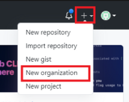
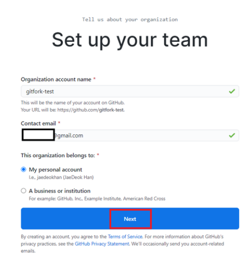
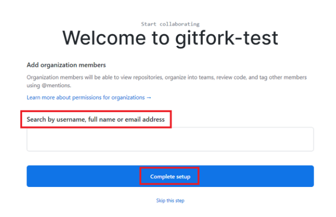
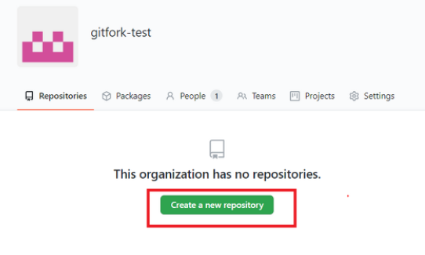
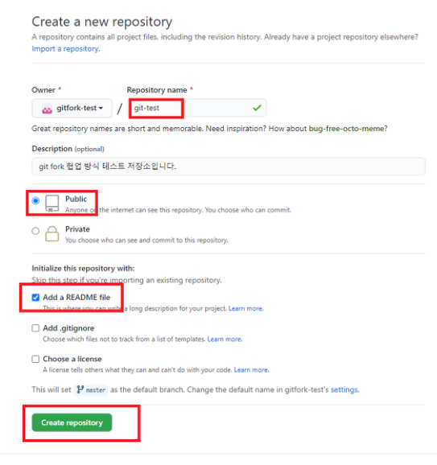
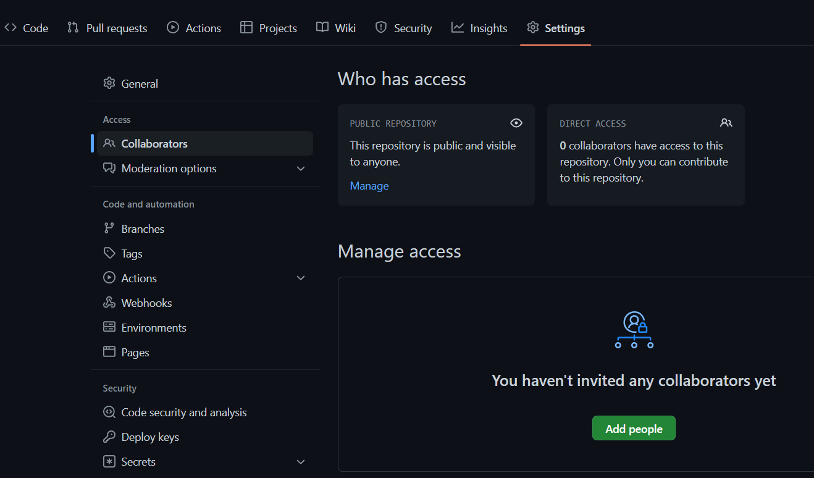
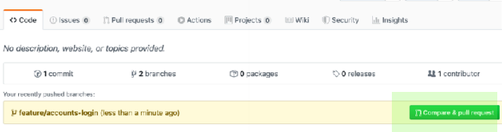
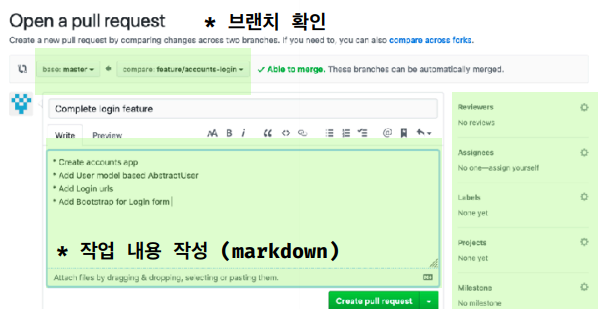

# 0. Shared Model과 차이점

push 권한이 나에게 없음

# 1. 조직 만들기

1. 조직 생성하기



2. 비용 설정(Free로 함)

   

3. 조직 설정

   

4. 팀원 초대하기

   


5. 설문조사 submit

   


# 2. 원격 저장소 만들기

1. Create a new repository 누르기



2. repository 설정

   

3. 팀원 추가로 초대하기(선택)

   생성된 원격 저장소 settings 클릭 -> 왼쪽 Access -> Collaborators 클릭 -> Add people 클릭 -> 추가 -> 초대 대상의 이메일로 초대링크가 전송됨.

   


# 3. clone하기

로컬 저장소에 fork한거 복사하기

1. 원하는 장소에서 오른쪽 클릭 -> bash 실행

2. 로컬 저장소에 복사하기

   ```bash
   git clone {원격 저장소 URL}
   ```


# 4. branch 생성 및 이동

```bash
# branch 생성
git branch {feature/기능}
# branch 이동
git checkout {feature/기능}

or

#branch 생성 및 이동
git checkout -b {feature/기능}

# branch 목록 및 사용중인 branch 확인(권장)
git branch -v
```


# 5. 내용 추가 or 수정

파일 내용 추가 및 수정


# 6. fork한 원격저장소에 보내기

```bash
# add
git add {파일이름.파일형식}

# add 확인(권장)
git status

# commit
git commit -m "메시지"

# commit 확인(권장)
git log

# push
git push origin {feature/기능}
```


# 7. 통합 요청하기

1. GitHub Flow에서 Compare&pull request 누르기

   

2. comment 남기고 Create pull request 누르기

   


# 8. 통합

1. merge 관리자는 팀 원격저장소 git에 들어가기

2. Pull requests에 들어가기

3. Merge pull request를 누르기

   병합시 commit 이력을 정리하기 위한 추가옵션 선택 가능(squash : 커밋 병합, rebase)

   

4. 확인 후 Confirm 누르기


# 9. 통합 후 로컬저장소 관리

1. 로컬 저장소 main 브랜치 이동

   ```bash
   git checkout main
   ```

2. 통합 완료한 branch 제거

   ```bash
   git branch -d {feature/기능}
   ```

3. 원격 저장소 추가

   ```bash
   git remote add upstream {공용 URL}
   ```

3. 통합한거 로컬저장소로 가져오기

   ```bash
   git pull upstream main
   ```

4. 기능 추가하기(선택)

   ```bash
   git checkout -b {feature/기능}
   ```

   