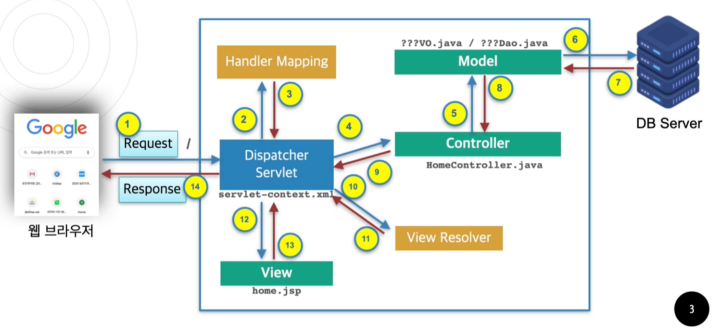
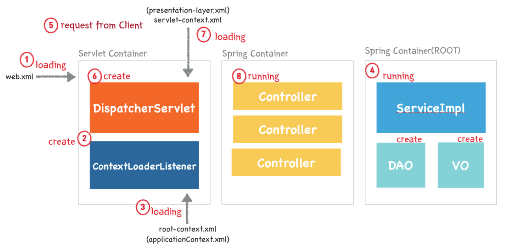

# 과정

​	

​	DispatcherServlet(Servlet) : 요청에 대한 컨트롤러 선택하여 요청 전달 / 처리 결과를 view에 전달

​	HandlerMapping(XML,Annotation) : 요청(url,a태그,form)에 따른 매핑(Controller로 이동)

​	Controller : 요청 처리결과를 DispatcherServlet에 전달

​	ModelView(VO,DAO) : 처리결과 및 필요한 정보 저장

​	ViewResolver : 처리결과를 전달할 뷰(페이지)파일 지정

​	View(jsp) : 처리결과를 jsp에 반영

| 순서   | 내용                                                         |
| ------ | ------------------------------------------------------------ |
| 1      | 클라이언트에 의해서 웹브라우져에서 Spring으로 제작된 웹 페이지에 대한 request가 보내짐. |
| 2, 3   | HandlerMapping(XML,Annotation)이 요청(url,a태그,form)에 따른 매핑(Controller로 이동) |
| 4.     | 2, 3의 과정을 통해서 찾아낸 Controller를 호출                |
| 5      | 페이지를 만들어내기 위해서 필요한 Model을 구성함(VO, DAO와 같은 클래스) -> VO : Value Object = 특정 record의 정보를 하나의 객체로 담기위한 객체 / DAO : Data Access Object = 객체들에 대한 접근방법에 대한 클래스 |
| 6, 7   | 쿼리문을 통해 데이터 베이스에 접근하여 페이지 처리에 필요한 정보들을 가져옴 |
| 8      | 구성한 Model을 Controller로 전달                             |
| 9      | 해당되는 Model을 Controller가 완성해서 이를 Dispatcher Servlet으로 전달 |
| 10, 11 | View Resolver를 통해서 request에 해당하는 View 파일(jsp)을 탐색함 |
| 12, 13 | 처리결과를 View 파일에 반영후 보냄                           |
| 14     | 완성된 View 파일을 클라이언트에게 전달하여 화면에 출력(response) |




| 순서 | 내용                                                         |
| ---- | ------------------------------------------------------------ |
| 1    | 웹 애플리케이션이 실행되면 Tomcat(WAS)에 의해서 web.xml 파일이 로딩 |
| 2    | web.xml에 등록되어 있는 ContextLoaderListener 생성 -> ContextLoaderListener 클래스는 ServletContextListener 인터페이스를 구현하고 있으며, ApplicationContext를 생성하는 역할을 수행함 |
| 3    | 생성된 ContextLoaderListener가 root-context.xml을 로딩       |
| 4    | root-context.xml에 등록되어 있는 Spring Container가 구동 -> 이 시점에서 개발자가 작성한 비즈니스 로직, DAO, VO 객체들이 생성 |
| 5    | 클라이언트로부터 웹 애플리케이션 요청(request)               |
| 6    | DispatcherServlet이 생성 -> Front Controller의 역할을 수행 -> 클라이언트의 request를 분석하여 해당하는 PageController에 전달하고 응답을 받아 요청에 어떻게 응답할지 결정 -> 실질적인 작업은 PageController에서 이루어짐(HandlerMapping, ViewResolver 클래스) |
| 7    | Dispatcher Servlet이 servlet-context.xml 파일을 로딩         |
| 8    | 두번째 Spring Container가 구동, 응답에 맞는 Page Controller들이 동작 -> 이 때 첫번째 Spring Container가 구동되면서 생성된 DAO, VO, Servicelmpl 클래스들과 협업하여 알맞은 작업을 처리 |


# 기타

PropertiesMethodNameResolver : url로 매핑된 객체의 특정 함수 사용


jdbc 설정 - config에 작성


# 다른점

DI

web.xml

action-servlet.xml

action-mybatis.xml

jdbc.properties

외부에서 쿼리문 전달 mapper 


# 경로 설정

pom.xml 에서 artifactId, name 을 프로젝트이름으로 변경

```
<artifactId>pro27</artifactId>
<name>pro27</name>
```


server.xml  path="/프로젝트이름" 으로 변경

```
<Context docBase="LoginSpring" path="/pro27" reloadable="true" source="org.eclipse.jst.jee.server:LoginSpring"/>
```

