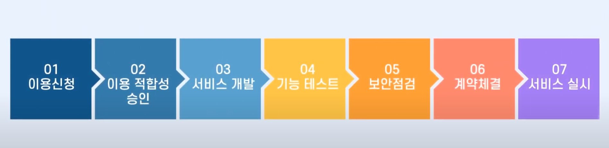
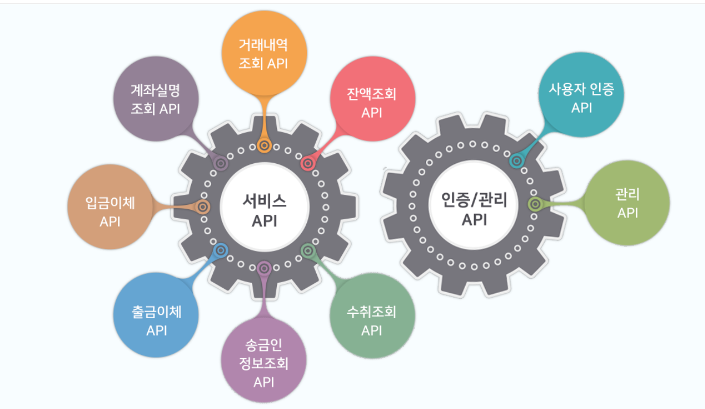

# 1. 오픈 뱅킹이란?

핀테크 기업과 개별 은행에 별도의 제휴 없이 핀테크 서비스를 원활하게 소비자에게 제공할 수 있도록 핵심 금융 서비스를 표준화된 API 형태로 제공하는 은행권 공동의 개방형 인프라

# 2. 절차

from 은행권, 핀테크 to 금융결제원, 금융 보안원, 금융위원회

# 3. 장점

소비자 : 하나의 앱으로 입금, 출금, 조회등 금융서비스를 편리하게 사용가능

핀테크 기업 : 낮아진 진입장벽, 저렴한 비용으로 금융서비스 제공 가능 -> 활발한 금융시장 진입 가능

​						고객의 니즈를 반영한 서비스들을 쉽게 개발 가능

# 4. 오픈 API

## 1. 서비스 API

### 1. 잔액조회 API

사용자가 이용기관이 제공하는 서비스를 통해 본인계좌에 대한 잔액 및 출금가능금액을 조회하는 기능을 제공합니다.

###  2. 거래내역조회 API

사용자가 이용기관이 제공하는 서비스를 통해 본인계좌에 대한 잔액 및 거래내역을 조회하는 기능을 제공합니다.

### 3. 계좌실명조회 API

이용기관이 자금을 수취할 수취인 또는 출금이체 신청을 한 사용자 계좌의 정상여부 및 실명을 실시간 조회하는 기능을 제공합니다.

### 4. 송금인 정보조회 API

이용기관이 자금을 출금이체 신청을 한 사용자 계좌의 정상여부를 실시간 조회하는 기능을 제공합니다.

### 5. 수취조회 API

이용기관이 입금이체 요청 전 수취계좌의 입금가능여부 및 수취인 성명을 실시간 조회하는 기능을 제공합니다.

### 6. 입금이체 API

이용기관의 지급계좌에서 자금을 인출하여 수취인 계좌로 실시간 입금하는 기능을 제공합니다.

### 7. 출금이체 API

이용기관의 출금에 동의한 사용자 계좌에서 출금하여 이용기관의 수납계좌로 실시간 입금하는 기능을 제공합니다.

## 2. 인증/관리 API

### 1. 사용자인증 API

사용자인증 API는 7개의 서비스 API를 사용하기 위하여, 일반고객(사용자)의 인증 및 동의를 얻고 계좌등록을 수행하는 기능을 제공합니다.
이용기관은 계좌에 접근하기 위하여 먼저 이용기관의 응용프로그램(앱)과 사용자의 오픈뱅킹용 계좌를 연결해야하며, 이때 사용자인증 API를 호출하여 사용자의 인증 여부를 물을 수 있습니다.
사용자는 오픈뱅킹에서 제공하는 연동페이지에서 인증하거나 이용기관이 자체적으로 제공하는 연동페이지에서 오픈뱅킹 연동을 할 수 있습니다.
이러한 인증 절차는 대부분의 인터넷 서비스(페이스북, 트위터 등)에서 실질적인 표준으로 적용하고 있는 OAuth* 인증절차를 준용하여 구현되었습니다.

- OAuth(Open Authentication) :

  오픈 API를 이용할 때 사용되는 표준화된 토큰 기반의 인증 방법

### 2. 관리 API

오픈뱅킹은 금융 업무를 처리하기 위한 7개의 서비스 API 이외에도 이용기관의 서비스 관리를 도와주는 관리 API를 제공합니다. 관리 API는 오픈뱅킹 운영 과정에서 이용기관의 요구를 반영하여 추가될 수 있으며, 현재는 참가은행의 서비스 상태를 조회하는 참가은행상태조회 API를 제공합니다.
이용기관은 참가은행상태조회 API를 호출하여 16개 참가은행의 서비스 상태를 한번에 조회할 수 있습니다.
참가은행의 서비스 상태는 “거래가능”(Y), “장애”(D), “개시이전”(L), “종료처리”(E)로 정의됩니다.

# 5. OAuth

OAuth(Open Authorization)란?

OAuth는 트위터의 개발자를 비롯한 일련의 웹 개발자들이 오픈 API의 인증(authentication; 이 사용자가 누구인가?)과 권한 부여(authorization; 로그인 한 사용자가 무엇을 할 수 있는가?)를 동시에 제공하는 인증 프로토콜을 찾다가, 결국 새롭게 만든 표준 사용자 인증 프로토콜입니다.
OAuth는 이전의 인증 방식인 구글의 AuthSub, 야후의 BBAuth, AOL의 OpenAuth 등의 장점을 결합하여 탄생되었으며, 2007년 12월 OAuth Core 1.0 스펙이 선언되었고 2010년 4월 IETF에서 OAuth 1.0 표준안을 RFC 5849([tools.ietf.org/html/rfc5849](http://tools.ietf.org/html/rfc5849))로 발표하였습니다.
현재는 응용프로그램 개발자의 편리성과 단순성을 좀 더 고려하여 새롭게 발표된 OAuth 2.0 표준안이 RFC 6749([tools.ietf.org/html/rfc6749](http://tools.ietf.org/html/rfc6749)) 로 제정되어 널리 사용되고 있습니다. 저희 오픈뱅킹은 OAuth 2.0 스펙을 준용하여 개발되었습니다.

[OAuth 더 알아보기](https://ko.wikipedia.org/wiki/OAuth)

용어 정의

OAuth는 기본적으로 3명의 서비스 주체 간에 이루어지는 3자(3-legged) 인증을 기반으로 합니다. 여기서 3자란, 각각 (1)API를 제공하는 오픈뱅킹, (2)오픈뱅킹이 제공하는 API를 이용하여 응용프로그램을 개발하는 이용기관, (3)이용기관의 응용프로그램을 사용하는 사용자를 의미합니다.
OAuth 2.0에서는 아래와 같이 용어를 정의하고 있습니다.

- 1 . 자원 소유자(Resource Owner)

  오픈뱅킹이 API를 통하여 제공하는 자원, 즉 데이터의 원래 소유자를 의미합니다. 예를 들면 오픈뱅킹이 제공하는 계좌 잔액 및 거래내역을 데이터라 고 하면 계좌의 소유자인 예금주가 자원 소유자가 됩니다. 오픈 API를 사용하여 개발된 응용프로그램을 사용하는 일반고객을 의미하며, OAuth 1.0 에서는 사용자(User)라는 용어를 쓰기도 하였습니다.

- 2 . 자원 서버(Resource server)

  보호된 자원을 제공하는 서버를 의미합니다. 즉, 은행 오픈 API를 통하여 계좌와 관련된 각종 데이터를 제공하는 오픈뱅킹 서버가 해당됩니다.
  OAuth 1.0에서는 서비스 제공자(Service Provider)라는 용어를 쓰기도 하였습니다.

- 3 . 클라이언트(Client)

  오픈 API를 호출하는 응용프로그램을 의미합니다. 즉, 이용기관이 오픈 API를 사용하여 개발한 앱 혹은 웹 프로그램이 해당됩니다. 넓은 의미로 이용 기관 자체를 의미하기도 합니다. OAuth 1.0에서는 API를 소비한다는 의미에서 소비자(Consumer)라는 용어를 쓰기도 하였습니다.

- 4 . 인증 서버(Authorization Server)

  자원 소유자로부터 접근 권한을 획득한 이후에 자원에 접근하기 위한 접근 토큰(Access Token)을 발급해주는 서버를 의미합니다. 즉, 오픈뱅킹 서버에 해당되며, 자원을 제공하는 자원 서버와 인증 처리를 수행하는 인증 서버를 기능적으로 분리하여 정의하였을 뿐입니다. OAuth 1.0에서는 통칭하여 서비스 제공자(Service Provider)로 정의하였습니다.
  오픈뱅킹에서는 이해의 편의를 위하여, (1)API를 제공하는 오픈뱅킹, (2)오픈뱅킹이 제공하는 API를 이용하여 개발된 이용기관의 응용프로그램(클라이언트), (3)이용기관의 응용프로그램을 사용하는 사용자로 지칭하겠습니다.

  

사용자 인증(3-legged)

클라이언트는 오픈뱅킹에 접속하여 API를 사용하기 위하여, 가정 먼저 사용자 인증(로그인)을 수행하여야 합니다. 사용자 인증은 클라이언트가 사용자의 오픈뱅킹 회원정보를 얻기 위한 절차이며, 사용자는 오픈뱅킹 계좌등록 시 진행되는 사용자 인증 절차를 진행하여 사용자 인증을 완료하게 됩니다.
동 절차는 OAuth 2.0의 Authorization Code Grant 절차를 준용하여 개발되었으며, 클라이언트는 사용자의 동의를 먼저 획득한 후에 이어서 오픈뱅킹 서버로부터 접근 토큰(Access Token)을 획득하여, 토큰의 유효기간 내에서 언제든지 사용자 회원정보에 접근할 수 있습니다.

계좌등록(3-legged)

클라이언트는 사용자 인증을 완료한 후에 사용자가 정보를 제공받고자 하는 계좌를 등록하도록 유도해야 합니다. 단, 오픈뱅킹에서는 사용자 편의를 위하여 멀티 스코프를 지원하고 있으므로 사용자 인증을 개별적으로 수행할 이유는 없으며 사용자 인증과 계좌등록이 동시에 이뤄지게 됩니다.
사용자의 개인정보를 보호하기 위하여 클라이언트는 사용자의 계좌정보(은행명, 계좌번호 등)를 직접 수집하여 등록할 수 없으며, 항시 오픈뱅킹의 계좌등록 페이지를 통하여 등록하여야 합니다. 동 절차는 OAuth 2.0의 Authorization Code Grant 절차를 준용하여 개발되었습니다.

핀테크이용번호

오픈뱅킹의 계좌등록 API를 사용하여 사용자의 계좌등록을 완료하면, 클라이언트는 사용자의 계좌번호 대신에 일종의 가상계좌번호 개념인 "핀테크 이용번호"를 응답 결과로서 수집하게 됩니다. 핀테크이용번호는 24자리 숫자로 구성되어 있으며, 클라이언트-사용자 쌍에 고유한 번호로 매핑됩니다.
즉, 핀테크이용번호는 해당 클라이언트 내에서만 유효합니다. 사용자는 클라이언트의 사용자인증 API 호출에 따라 팝업된 오픈뱅킹 계좌등록 페이지 에서 계좌를 등록할 수 있으며, 계좌해지 API를 호출하여 해당 계좌에 대한 서비스 이용을 해지할 수도 있습니다. 클라이언트는 핀테크이용번호를 수집한 이후에 잔액조회, 거래내역조회, 출금이체, 입금이체 시에 핀테크이용번호를 입력하여 API 기능을 수행할 수 있습니다.

클라이언트 인증(2-legged)

오픈 API의 성격에 따라서 사용자의 개입 없이 클라이언트와 오픈뱅킹 간의 양자(2-legged) 인증만을 획득할 수도 있습니다. 예를 들면 계좌실명조회 API와 같이 특정 사용자의 계좌정보를 조회하는 것이 아니라 클라이언트가 알고 있는 임의의 계좌번호에 대하여 예금주의 실명을 확인코자 하는 경우에, 오픈뱅킹은 클라이언트의 유효성만 확인한 후에 데이터를 응답하게 됩니다. 이용기관이 오픈뱅킹에 가입하고 가입승인이 완료된 후에 앱 등록을 완료하게 되면, 하나의 클라이언트에 대해서 클라이언트 아이디(ID)와 비밀번호(Secret)를 발급받게 됩니다. 이후 오픈뱅킹은 클라이언트 아이디와 비밀번호를 확인하여 클라이언트 인증을 수행하게 됩니다. 동 절차는 OAuth 2.0의 Client Credentials Grant 절차를 준용하여 개발되었습니다.

