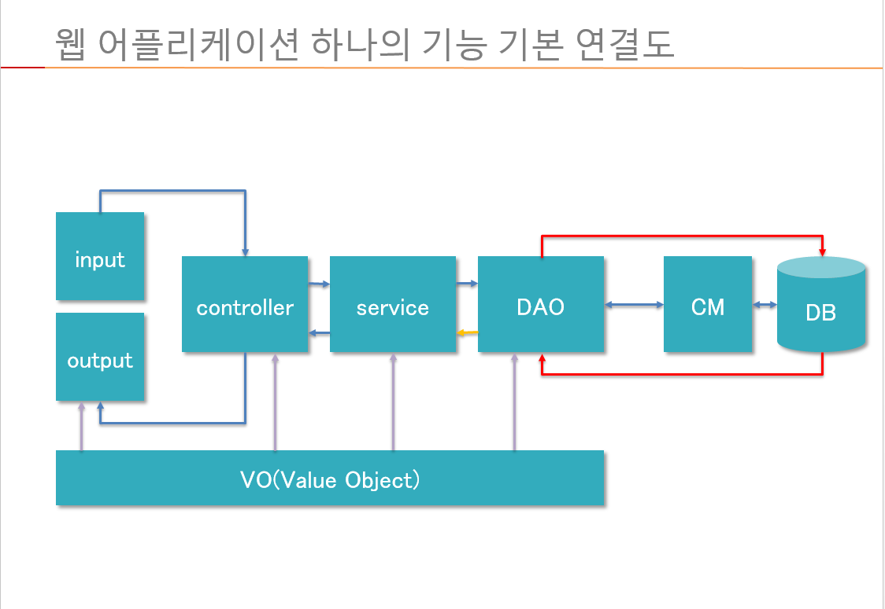

# MVC

1. View(Client) - jsp

   in : (url, a태그, form)로 request  -> request 객체에 정보 담음

   out : (url, a태그)로 response -> response객체에 담아서 넘김

2. Controller(Servlet) -java

   mapping

   요청 데이터 전달 / 로직처리 결과물 전달

3. Model

   VO : 데이터 객체

   Service : 로직 처리(절차적) - 복잡한거

   DAO : DB CRUD(비절차적)

   

Client -> request(url or a태그 or form) -> request 객체에 정보 담음 -> controller -> Service(로직) -> DAO -> DB  -> DAO -> Service -> controller -> response 객체에 담음 -> response(url or a태그) -> client

# 바인딩 내장객체

## 	Request 

RequestDispatcher

일회성 - 메모리에 부담 ㄴㄴ

2~3페이지 연결 

A->B 객체 != A->C 객체

request.setAttribute("key", "value")

웹페이지 간 데이터 공유  

RequestDispatcher dispatch = request.getRequestDispatcher("보낼 장소");  // 여러페이지를 연결

dispatch.forward(request,response); //연결된 페이지에 보냄

이동하고 url이 안바뀜

SendRedirect -> 서블렛간 데이터 전송 ㄴㄴ / get방식(url) - 보안 안좋음

페이지마다 객체가 다름

어떤 페이지라도 연결가능

페이지가 변함

## 	Session

이벤트시작~~끝 or 특정시간 동안 데이터 저장-> 메모리에 부담

수십페이지

A->B 객체 = A->C 객체

HttpSession session = request.getSession();

session.setAttribute("key","value")

변수타입 변수이름 = (변수타입)session.getAttribute("key")

# Connection pool

수많은 요청 빠른 응답을 위한 DB구성

요청할때 connection 안만들고 미리 만들어진 connection  대여 및 반납

JNDI : connection 정보 관리

# Ajax

페이지 이동없이 데이터 처리

제이쿼리 Ajax 사용법 - $.ajax({})

# 정리

페이지 연결을 어떻게?  - 요청(url,a태그,form)

컨트롤러에 작업요청은 어떻게? - url 작업의 종류를 보낸다 -> QueryString, 다르게 식별되는 페이지명

작업처리결과 클라이언트에게 어떻게 전달? - 요청 객체, 세션객체, 어플리케이션 객체에 저장해서 전달

컨트롤러,서비스,DAO는 어떻게 구별? - 클라이언트로 부터의 요청과 데이터를 받고 처리결과를 전송 / 컨트롤로에게 받은 데이터와 DAO에서 받은 데이터를 가지고 비지니스 로직처리하여 컨트롤러에게 결과 전달 / 데이터베이스에 연결하여 필요한 데이터를 가져와서 서비스나 컨트롤러에게 전달

데이터클래스의 용법은 무엇? - 서로 관련있는 데이터를 하나로 묶는 역할, 각 단계로 한 셋트의 데이터를 묶어서 전달

클라이언트의 역할에서 input과 output의 차이점은 무엇? - input : 작업지시의 시작 / 작업지시의 결과

서버로 이동없이 데이터 처리를 할 수 없을까? - Ajax 라이브러리

클라이언트에서 데이터를 수집하는 방법은 어떤것이 있는가? - form데이터, QueryString

DB에서 CRUD 쿼리를 어떻게 전달하고 결과를 받을 수 있는가? - JDBC를 통해서 Connection->Statement->ResultSet

# 할 수 있어야됨

1.  MVC프로젝트를 생성할 수 있어야 한다.
2.  프로젝트 환경설정을 할 수 있어야 한다.
3.  클라이언트 소스 및 파일의 위치를 결정하고 접근할 수 있어야 한다.
4.  리소스 파일(이미지,CSS,JS,XML,기타), 자바 코드, JSP/HTML 코드를 구분하여 저장할 수 있어야
    한다.
5.  MVC구조를 이용하여 Login을 실행하고 결과를 출력한다.
    a. 페이지 이동 방식
    b. ajax 이동 방식

6. MVC에 관련된 3군데의 네트워크를 연결하는 방법을 알고 있어야 한다.
   a. 페이지 연결
   b. 자바클래스 연결
   c. 데이터베이스 연결

7. 요청/응답 처리, 비즈니스 로직처리, 데이터베이스 연결처리를 할 수 있어야 한다.

8. 위의 모든 것은 클라이언트의 요구사항에 대응해야 한다.

# Ref

1~5장 - 기초

6~8,11,12,16 - 프로그래밍

17 - 나머지
